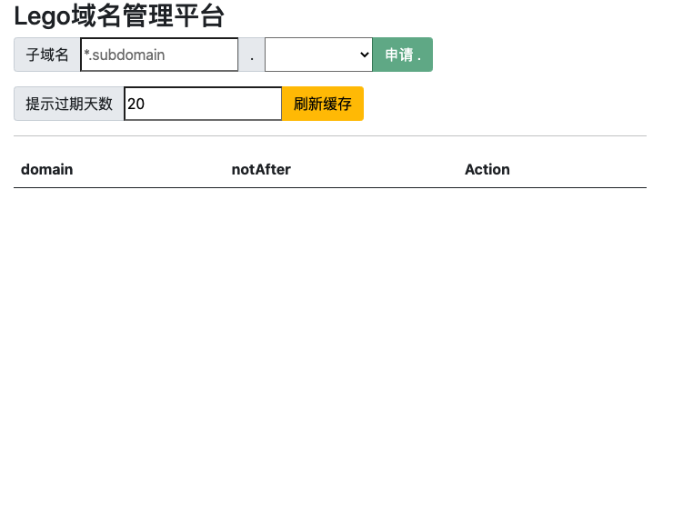

# lego-certmgr 一款使用 lego 生成域名证书的代理服务

`lego-certmgr` 是一个基于 [lego - Github](https://github.com/go-acme/lego) Libiray 封装的证书申请 **代理** 。

其目的是

1. 为了快速方便的申请 **Let's Encrypt** 证书
2. 提供 RESTful API 接口， 方便下游系统 (ex `cmdb`) 调用并进行资源管理


## 使用说明

访问 `http(s)://yourdomain.com` 可以进入图形化界面


### 下载 

访问 Github 下载最新版 lego-certmgr [GitHub Release - lego-certmgr](https://github.com/tangx/srv-lego-certmgr/releases/latest)


## Usage

使用 `https://github.com/go-jarvis` 替换 **网站路由管理** 和 **配置管理** 下 
1. `go-jarvis/rum-gonic` 替换 `gin-gonic/gin` 管理 apis 路由
2. `go-jarvis/jarvis` 替换 `viper` 管理环境变量

### 使用配置文件

1. 如果使用 bin 文件执行， 可以在 bin 所在目录下创建配置文件 `config/default.yml`

```yaml
# alidns
LegoCertManager__Alidns_AccessKey: ""
LegoCertManager__Alidns_Email: ""
LegoCertManager__Alidns_Enabled: true
LegoCertManager__Alidns_Nameserver: ""
LegoCertManager__Alidns_SecretKey: ""

# dnspod
LegoCertManager__Dnspod_Email: ""
LegoCertManager__Dnspod_Enabled: true
LegoCertManager__Dnspod_Nameserver: ""
LegoCertManager__Dnspod_Token: "1231,123123123123"


LegoCertManager__BackendManager__FileSystem_DirPath: lego-certmgr
LegoCertManager__BackendManager_ClassName: filesystem

LegoCertManager__HttpServer_Addr: ""
LegoCertManager__HttpServer_Port: 80
```


2. 如果是容器运行， 也可以使用 **同名** 的 **环境变量**。
例如：

```bash
export LegoCertManager__Dnspod_Email="user@example.com"
# ...

./certmgr
```

**路由**

```bash

[GIN-debug] GET    /                         # 首页
[GIN-debug] HEAD   /                         
[GIN-debug] GET    /lego-certmgr/list        # 展示有效证书
[GIN-debug] GET    /lego-certmgr/list-all    # 展示所有证书
[GIN-debug] GET    /lego-certmgr/query/:domain  # 根据证书域名查询证书
[GIN-debug] GET    /lego-certmgr/query/:domain/download  # 根据证书域名下载证书压缩包
[GIN-debug] POST   /lego-certmgr/gen/:provider/:domain   # 根据 dns 解析上和 域名 创建证书。
2021/12/22 17:11:14 [Rum] Listening and serving HTTP on :80
```

> provider: `alidns` or `dnspod`


### 简单的页面



