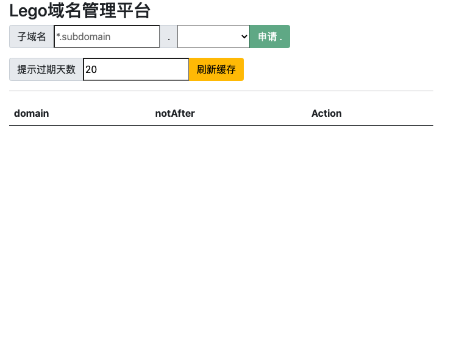

# lego-certmgr 一款使用 lego 生成域名证书的代理服务

`lego-certmgr` 是一个基于 [lego - Github](https://github.com/go-acme/lego) Libiray 封装的证书申请 **代理** 。

其目的是

1. 为了快速方便的申请 **Let's Encrypt** 证书
2. 提供 RESTful API 接口， 方便下游系统 (ex `cmdb`) 调用并进行资源管理

因此

1. `certmgr` 为了方便快速返回已生成过的证书而缓存了一份结果。
2. 由于 `certmgr` 定位是 **代理** ， 所以并未考虑证书的 **持久化** 和 **过期重建** 操作。 

## 使用说明

访问 `http(s)://yourdomain.com` 可以进入图形化界面



### 下载 

访问 Github 下载最新版 lego-certmgr [GitHub Release - lego-certmgr](https://github.com/tangx/srv-lego-certmgr/releases/latest)


## Usage

使用 `viper` 进行配置管理， 可以通过 `环境变量` 或 `配置文件` 进行参数传递

### 通过环境变量

```bash
export DNSPOD_API_KEY=123123123,123123
export ADMIN_EMAIL=xxxx@example.com

./certmgr --dnspod

# 
export ALICLOUD_ACCESS_KEY=ACCasdfasdfasdf
export ALICLOUD_SECRET_KEY=SECaasdf0sdfa02sdfa
export ADMIN_EMAIL=xxxx@example.com

./certmgr --alidns

```

### 使用配置文件

+ 路径为 `$HOME/certmgr` 或 `程序当前目录`
+ 文件名为 `config.yml / config.yaml`

```yaml
# dnspod
DNSPOD_API_KEY : 123123123,123123

# alidns
ALICLOUD_ACCESS_KEY : ACCasdfasdfasdf
ALICLOUD_SECRET_KEY : SECaasdf0sdfa02sdfa

ADMIN_EMAIL : xxxx@example.com
```

**路由**

```log
WARN[0000]/Users/tangxin/data/gopath/pkg/mod/github.com/tangx/goutils@v1.3.2/viperx/viperx.go:48 github.com/tangx/goutils/viperx.ReadInConfig() Config File "config" Not Found in "[/tmp/srv-lego-certmgr/cmd/certmgr /Users/tangxin/lego-certmgr]"
2021/12/21 15:22:17 [INFO] acme: Registering account for uyinn@live.com
[GIN-debug] GET    /                         --> github.com/gin-gonic/gin.(*RouterGroup).StaticFile.func1 (4 handlers)
[GIN-debug] HEAD   /                         --> github.com/gin-gonic/gin.(*RouterGroup).StaticFile.func1 (4 handlers)
[GIN-debug] POST   /lego-certmgr/gen/dnspod/:domain --> github.com/tangx/srv-lego-certmgr/cmd/certmgr/routes/certgen.ApplyCertificateHandler (4 handlers)
[GIN-debug] GET    /lego-certmgr/gen/dnspod/:domain --> github.com/tangx/srv-lego-certmgr/cmd/certmgr/routes/cert.GetHandler (4 handlers)
[GIN-debug] GET    /lego-certmgr/query/:domain --> github.com/tangx/srv-lego-certmgr/cmd/certmgr/routes/cert.GetHandler (4 handlers)
[GIN-debug] GET    /lego-certmgr/query/:domain/download --> github.com/tangx/srv-lego-certmgr/cmd/certmgr/routes/cert.DownloadHandler (4 handlers)
[GIN-debug] GET    /lego-certmgr/list        --> github.com/tangx/srv-lego-certmgr/cmd/certmgr/routes/cert.ListHanlder (4 handlers)
[GIN-debug] GET    /lego-certmgr/list-all    --> github.com/tangx/srv-lego-certmgr/cmd/certmgr/routes/cert.ListAllHanlder (4 handlers)
[GIN-debug] GET    /lego-certmgr/healthy     --> github.com/tangx/srv-lego-certmgr/cmd/certmgr/routes/healthy.HealthyHandler (4 handlers)
[GIN-debug] GET    /lego-certmgr/provider/map --> github.com/tangx/srv-lego-certmgr/cmd/certmgr/routes/provider.getDpmHandler (4 handlers)
[GIN-debug] POST   /lego-certmgr/provider/map --> github.com/tangx/srv-lego-certmgr/cmd/certmgr/routes/provider.appendDpmHandler (4 handlers)
[GIN-debug] Listening and serving HTTP on :80
INFO[0001]/tmp/srv-lego-certmgr/cmd/certmgr/routes/certgen/generator.go:73 github.com/tangx/srv-lego-certmgr/cmd/certmgr/routes/certgen.retryApply.func1() 启动 dnspod 重试队列
```

> provider: `alidns` or `dnspod`

## todo

+ [x] 优化 `routes/qcloud` ， 使其完成多 provider 注册式功能， 以支持多 provider
+ [x] 优化 **初始化设置** 支持读取配置文件或环境变量， 实现多 provider 注册。 
+ [ ] 优化 `initial` 逻辑 ， 同一个 email 只向 `let's encrypt` 注册一次
